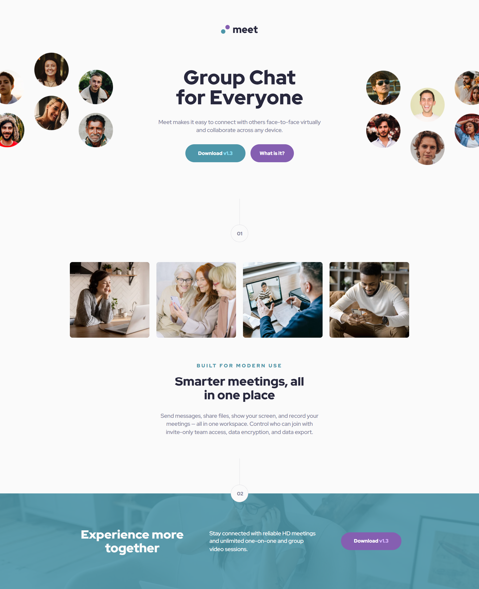
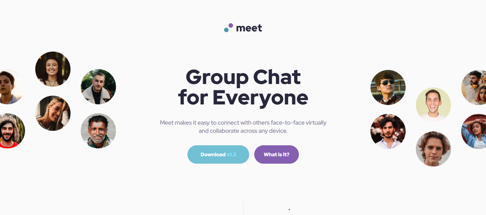
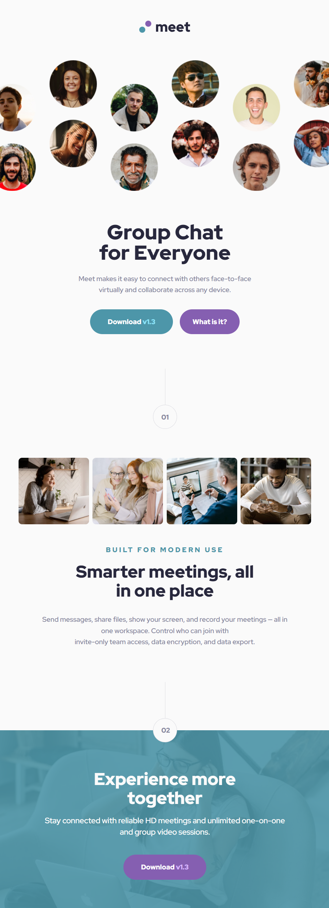

# Frontend Mentor - Meet landing page solution

This is a solution to the [Meet landing page challenge on Frontend Mentor](https://www.frontendmentor.io/challenges/meet-landing-page-rbTDS6OUR). Frontend Mentor challenges help you improve your coding skills by building realistic projects. 

## Table of contents

- [Overview](#overview)
  - [The challenge](#the-challenge)
  - [Screenshot](#screenshot)
  - [Links](#links)
- [My process](#my-process)
  - [Built with](#built-with)
  - [What I learned](#what-i-learned)
- [Author](#author)
- [Acknowledgments](#acknowledgments)


## Overview

### The challenge

Users should be able to:

- View the optimal layout depending on their device's screen size
- See hover states for interactive elements

### Screenshot
Desktop preview:


Hover preview:


Responsive:

Tablet preview:


Mobile preview:


### Links

- Solution URL: [Repository](https://github.com/amoraleslandeo/Meet-landing-page.github.io)
- Live Site URL: [Web page](https://amoraleslandeo.github.io/Meet-landing-page.github.io/)

## My process

### Built with

- Semantic HTML5 markup
- SCSS 
- Flexbox

### What I learned

I learned to use this attribute that controls the z axis and orders the position of an element on the axis. 
```css
  z-index: 1;
```

I learned this attribute that allow to insert other characteriscs to the tag.
```css
&:before {
  content: " ";
}
```

In this project I learned to developed a full page 'Meet landing' wich included a responsive configuration for tablet and mobile. 

## Author

- Website - [Alejandro Morales Landeo](https://github.com/amoraleslandeo)
- Frontend Mentor - [@amoraleslandeo](https://www.frontendmentor.io/profile/amoraleslandeo)


## Acknowledgments

I wanna say thanks to my daily support [Roberto](https://github.com/RobertoSilvaZ) 🙌😉 who has become my developer Mentor and guide through this process that is just beggining.

